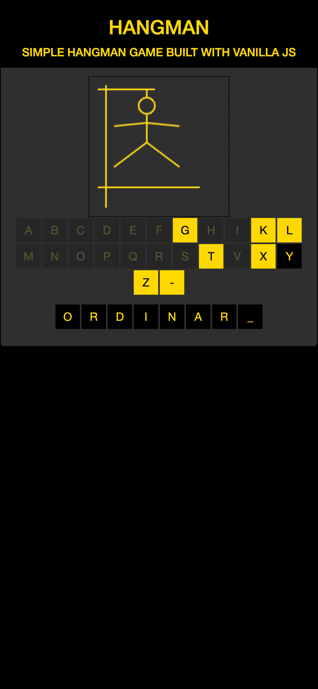

Simple Hangman Game built with Vanilla JS with use of external random word generator. 

**TODO:**  
**1**.Extend functionality of external api to choose between 3 categories (adjective,animal,noun)  
**2**.Make modal show when user wins game.

